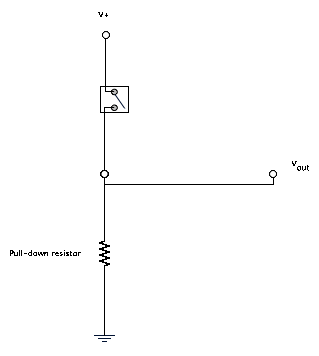

# Aula 1 : Photogate
###### sim, aquele mesmo do lab de física...

### Material:
  * Push Button
  * Resistor 10k
  * Emissor IR
  * Receptor IR

## Lógica Binária:
  
  Conceitos de:
  * Operadores lógicos (and, or, ...)
  * Bit Masks

## GPIO:

  Generic Purpose Input and Output.
  
  Primeiramente, explicar rapidamente os conceitos:
  * Porta: Array de pinos (byte de pinos)
  * Pino: O pino onde conectamos os fios
  * Modo de opereção (Input or Output): O pino pode estar configurado como entrada ou saída (mudança na impedância)
  
  Com os conceitos explicados, mostrar código abaixo para acender o led do pino 13 (já existente na placa do Arduino)
  
```c
void setup()
{
  DDRB |= (1 << PB5); // Configura modo do pino 13 como saida
  PORTB |= (1 << PB5); // "Liga" o pino. Ja configurado como saida, ele pode estar "ligado" ou "desligado"
}

void loop()
{
  
}
```
  
  Explicar o que acontece no código, o que são registradores e que estamos escrevendo nos registradores de I/O.
  
  A partir de agora vamos definir "Ligado" e "Desligado" como "Alto" e "Baixo". Isso se deve ao nível da tensão (que é lógica, por isso os 2 estados) nos pinos.
  
  Com a entrada funcionando, vamos agora trabalhar com uma entrada para interagir com esse led.
  Para usar um botão precisamos entender o que é um pullUp ou um pullDown:
  
  
  
  Se retirarmos o resistor do circuito da figura, no momento em que a chave estiver aberta o estado da entrada estará indefinido, será um circuito aberto. Não sabemos se aquele sinal está Alto ou Baixo, e o que ocorre de fato é uma oscilação, um bouncing. Com o resistor, no momento em que a chave é aberta o circuito continua fechado com o Ground (PullDown) ou o Vcc (PullUp) e o estado definido.
  
  Vamos agora fazer um circuito para utilizarmos o botão para acender e apagar nosso led.
  
  Para isso, apresentar o datasheet e pedir para todos procurarem os registradores responsáveis por fazer o GPIO e descobrir como fazer a leitura de um pino.
  
```c
void setup()
{
  DDRB |= (1 << PB5); // Configura modo do pino 13 como saida
  DDRB &= ~(1 << PB4); // Configura modo do pino 12 como entrada
}

void loop()
{
  if (PINB & (1 << PB5)) // Se o pino 12 estiver alto
  {
    PORTB |= (1 << PB5); // Pino 13 Alto (Led ligado)
  } else {
    PORTB &= ~(1 << PB5); // Pino 13 Baixo (Led desligado)
  }
}
```

##Atividade:
Agora vamos brincar com os receptores e emissores IR para criar um Photogate:
Por enquanto, a contagem do tempo deve ser feita usando funções fornecidas, mas isso será visto em aulas futuras.

```c
void setup()
{
  DDRB |= (1 << PB5); // Configura modo do pino 13 como saida
  DDRB &= ~(1 << PB4); // Configura modo do pino 12 como entrada
}

void loop()
{
  if (PINB & (1 << PB5)) // Se o pino 12 estiver alto
  {
    PORTB |= (1 << PB5); // Pino 13 Alto (Led ligado)
  } else {
    PORTB &= ~(1 << PB5); // Pino 13 Baixo (Led desligado)
  }
}
```